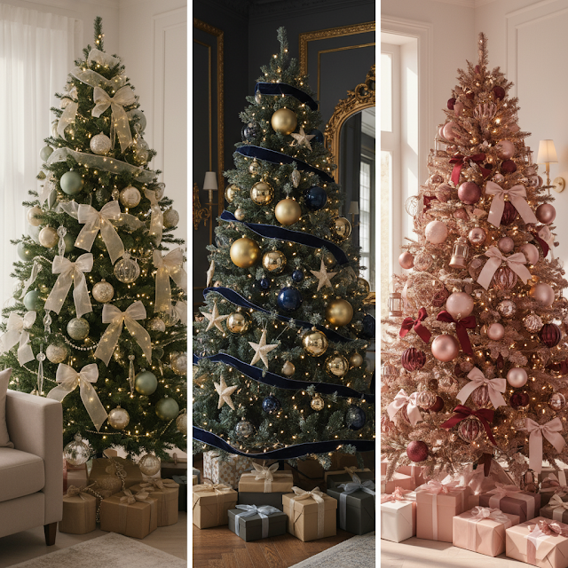
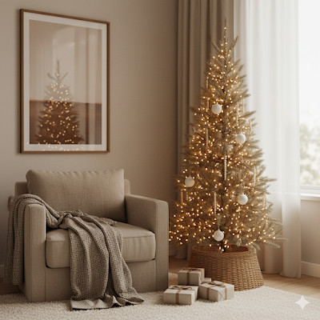

# 33 Christmas Tree Decoration Ideas for 2025 (Modern, Cozy & Small-Space Friendly)

You stare at your empty corner, your tree still in the box, and your brain whispers, “Red and green again?” I feel that. I scroll past those perfect catalog trees, roll my eyes, and style my tree in a very normal living room with a normal-person budget and an Amazon tab open. :)

If you want **Christmas tree decoration ideas for 2025** that look modern, cozy, renter-friendly, small-space approved, and actually realistic, you hang out in the right place. I treat home decor way too seriously (IMO), and Christmas tree styling sits at the top of that obsession list. So I help you build a tree that looks expensive, fits your space, works with your decor, and quietly flexes in every photo.

## 1. 2025 Christmas Tree Trends That Actually Work at Home

Before you throw random ornaments at your tree, you choose one clear direction. That single decision already upgrades your setup.

For **Christmas 2025**, these styles fit real homes:

  - **Warm neutrals + soft luxe:** Caramel, cream, champagne, latte browns, muted greens. These tones blend with modern, beige, boho, and minimal interiors.

  - **Jewel tones + soft pink:** Emerald, navy, ruby, with soft blush accents. You create a rich, moody tree without loud chaos.

  - **Natural textures:** Wood, rattan, linen, jute, paper, dried fruit, clear glass. You keep the tree cozy, calm, and grown-up.

  - **Scandi calm:** Fewer ornaments, simple shapes, warm lights, lots of breathing space.

  - **Playful "Kitschmas" corners:** Candy colors, retro shapes, cute characters for kids or your inner eight-year-old.

**Key move:** Match your tree to your living room, not a catalog. Ask yourself: **"Does this tree look like it lives here?"** If yes, you already win.

## 2. Get the Basics Right: Tree, Lights, and Shape

You cannot fake a good tree on a bad base. You choose the right tree, the right lights, and the right shape, then everything else lands easier.

## Choose the Right Tree

  - In a **small apartment**, pick a **slim or pencil tree** so you save precious floor space.

  - Stay around **180–210cm** so the tree looks tall but not aggressive.

  - Pick a **realistic faux tree** with dense branches if you love layered decor.

**Shop my favorite base picks:**

  - [Slim faux Christmas tree with warm white lights](https://amzn.to/3K4CiTj)

  - [Neutral rattan tree collar](https://amzn.to/47RnKyd)

## Layer the Lights Like a Stylist

  - Choose **warm white** or soft golden lights for a cozy, high-end look.

  - Start near the trunk and move outwards so the tree glows from inside.

  - Use plenty of lights so the tree looks rich, not dull.

**Pro move:** Combine one regular string with one micro-light string. That combo adds depth and turns your tree into a soft-glow centerpiece.

**Essentials to grab:**[ Warm white string lights](https://amzn.to/4i3FrPV), [micro fairy lights](https://amzn.to/3LDLY7M).

## 3. Christmas Tree Color Palettes for 2025 That Look Luxe

You skip random rainbow chaos and commit to a **2–3 color palette**. That rule alone makes your tree look designer.

## Sage Green + Champagne + Warm White

  - Perfect for neutral or earthy homes.

  - Use sage baubles, champagne metallics, ivory or sheer ribbon.

  - Add clear glass ornaments for a light, airy finish.

**Get the look:**
[Sage and champagne ornament set](https://amzn.to/3JOzucY),[
Ivory sheer ribbon](https://amzn.to/4p6iy0n),

## Navy + Gold + Cream

  - Ideal for modern, bold, or darker interiors.

  - Use navy velvet ribbon, gold ornaments, and cream details.

  - Keep shapes simple so the colors lead.

## Blush + Burgundy + Rose Gold

  - Soft, romantic, and warm.

  - Mix matte and gloss finishes for depth.

  - Place decor evenly so the tree still feels calm.

**Non-negotiable:** If an ornament ignores your palette or theme, you retire it for this year. You protect the overall look.

## 4. Small Apartment & Balcony Christmas Tree Ideas

Your space feels small, but you style it like a strategy, not a struggle.

  - **Slim tree in a corner:** Pair it with a basket or rattan collar.

  - **Half or flat-back tree:** Use this when you push against a wall.

  - **Mini tree on a console or table:** Perfect for studios and rentals.

  - **Balcony tree:** One slim tree, fairy lights, and a few bold ornaments create a magical view from your sofa.

**Small-space friendly picks:**

  - [Slim 6ft pencil tree](https://amzn.to/3WSdPUd)

  - [Mini tabletop tree set](https://amzn.to/3WWJJPs)

  - [Battery-operated balcony fairy lights](https://amzn.to/4p4oPK2)

Ask yourself: **"Can I walk around this without swearing at it?"** If yes, the size works.

## 5. Budget-Friendly & Amazon-Ready Ideas That Still Look Designer

You create a luxe tree without burning your wallet. You just choose with intention.

  - Pick **one cohesive ornament set** in your palette as your base.

  - Add **plain matte or glass baubles** to fill space.

  - Use **velvet or satin ribbon** for bows and garlands instead of random plastic decor.

  - Choose **one hero element**: bells, wooden houses, metal ornaments, or paper stars.

**Budget-friendly staples I love:**

  - [Mixed matte and gloss bauble set](https://amzn.to/4qYRKB7)

  - [Velvet ribbon roll](https://amzn.to/3JXNJfr)

  - [Paper star or snowflake set](https://amzn.to/47WyMlI)

I grab simple baubles, layer one beautiful set, add ribbon, and let the palette do the heavy lifting. That combo always looks curated, even with a tight budget.

**Rule:** 1–2 hero items + strong basics always beat clutter.

## 6. Christmas Tree Themes 2025 That Fit Real Homes

You design themes that normal humans can copy on a Sunday, not only stylists on shoots.

## Modern Minimal

  - Colors: white, black, clear, metallic.

  - Use simple baubles and glass ornaments.

  - Keep branches visible and layout clean.

## Neutral Scandi Cozy

  - Colors: beige, white, soft green, wood.

  - Use wooden beads, paper ornaments, linen bows.

  - Create a calm, soft, natural look.

**Scandi-style picks:**
[Wooden bead garland,](https://amzn.to/4r13NOk)
[Paper ornament set](https://amzn.to/49SOCAy).

## Farmhouse Warm

  - Colors: red, green, burlap, gingham.

  - Use plaid ribbons, rustic bells, wooden signs.

  - Lean into cozy, family-friendly vibes.

## Kids & Family Tree

  - Use candy canes, character ornaments, handmade crafts.

  - Create one fun zone or a separate kid tree so your main tree still follows your theme.

**Fun picks for kids:**
[Colorful character ornament set](https://amzn.to/3LDhXVG),
[Candy cane ornament pack](https://amzn.to/4oJfQ1c).

FYI, that "one pretty tree + one fun tree" strategy saves both your aesthetic and your sanity.

## 7. Step-by-Step: Decorate Your Tree Like a Stylist

You follow this order and your tree looks intentional every single time.

  - **Fluff the tree:** Open every branch and cover gaps.

  - **Add lights:** Start near the trunk, work outwards, spread them evenly.

  - **Add ribbon or garland:** Tuck in soft curves or vertical drops instead of tight spirals.

  - **Place statement ornaments:** Add your large or special pieces first at eye level and mid sections.

  - **Fill with medium and small ornaments:** Work from the inside out for depth and balance.

  - **Finish the base and topper:** Use a basket, collar, or layered fabric and choose one bold topper.

**Quick shop the essentials:**
[Warm white lights](https://amzn.to/4o1Vwa9),
[Micro lights](https://amzn.to/3WSiplk),
[Tree topper](https://amzn.to/44642xF),
[Tree collar or skirt.
](https://amzn.to/3LJg7CA)

You control the order, so you avoid the classic "I forgot the ribbon" meltdown.

## 8. Quick FAQ: Real Questions, Real Answers

## How do I decorate a Christmas tree in a small apartment?

You pick a slim tree, tuck it into a corner, match your room’s colors, and keep decor vertical and light. You avoid bulky skirts and giant ornaments and rely on lights and a tight palette.

## What are the trending Christmas tree colors for 2025?

You see warm neutrals, sage, navy, blush, jewel tones, and soft metallics. You choose the palette that flows with your existing decor so the tree feels intentional.

## How do I decorate on a budget without looking cheap?

You choose one color story, buy one solid base set of ornaments, add ribbon, layer one or two special pieces, and keep everything consistent. You avoid random impulse decor that breaks the theme.

## Should I use a real or faux Christmas tree?

You pick a faux tree if you want control, reuse, and easy styling. You pick a real tree if you love the scent and ritual. Both look amazing when you style with good lighting and a clear palette.

## Make It Look Expensive, Keep It Real

Don't chase every trend. Pick one vibe, stick to 2-3 colours, invest in strong basics, and layer a few smart finds where they count. Style for your actual home—not a Pinterest board.

And if one ornament doesn't match your palette this year? Box it. You're protecting the overall look, not hoarding. Your tree deserves its best year yet.

