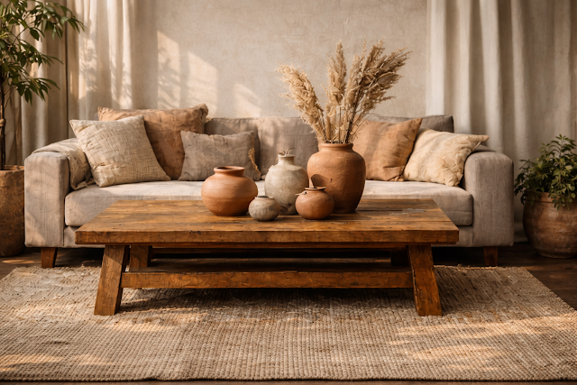
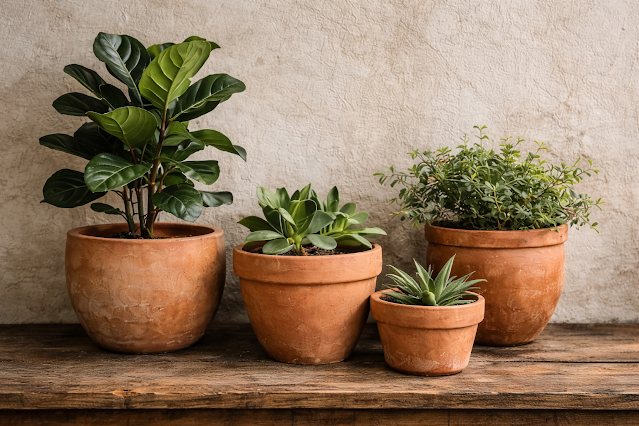
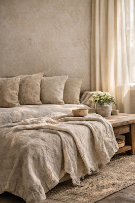
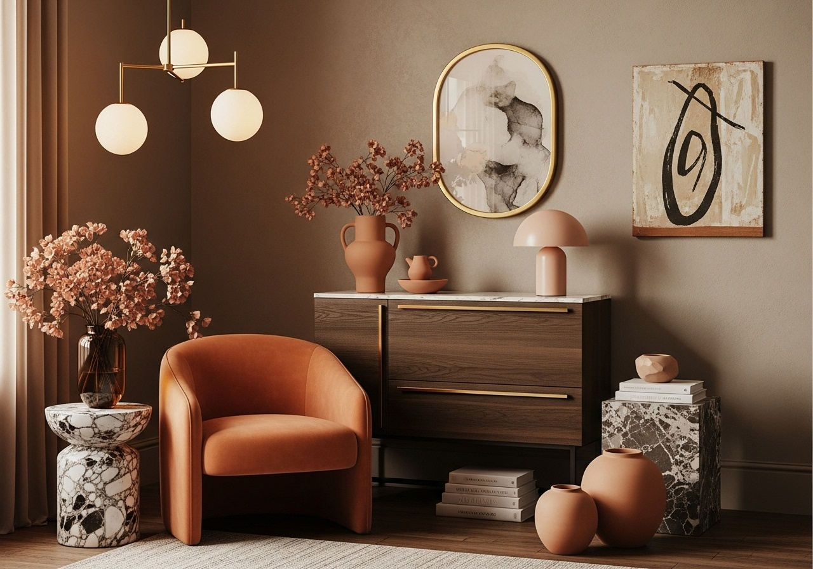

# How to Use Clay, Terracotta & Natural Materials Without Your Home Looking Like a Pottery Barn

There's a version of "natural materials in the home" that works beautifully—warm, grounded, modern. And then there's the version that looks like you raided a craft fair. The difference is restraint.

I've been styling with clay, terracotta, wood, and stone for a while now, and the biggest lesson? These materials don't need much help. They're already interesting. The mistake most people make is adding too many of them at once, or pairing them with the wrong finishes.

Here's how to do it right.

*As an Amazon Associate, I earn from qualifying purchases.*

## Why Natural Materials Actually Work in Modern Spaces

Modern homes tend to lean clean, minimal, maybe a bit sterile. That's exactly why natural materials hit so hard—they add the warmth and texture that sleek surfaces lack. A room with only glass, metal and white walls feels like a showroom. Add one terracotta vase, a linen throw, and a wooden tray? Now it feels like somewhere a person actually lives.

The current [design trends for 2025](/blog/interior-design-trends-2025) are all heading this direction—organic textures, earth tones, handmade over machine-made. It's not a fad. It's a correction. We overcorrected into sterile minimalism and now we're swinging back toward *human* spaces.

## Terracotta: The Material That Does Everything

### Planters (The Obvious One)

Look, [terracotta planters](https://amzn.to/4peaDxM) are a cliché at this point. But they're a cliché because they *work*. The porous material is genuinely better for most houseplants—it prevents root rot, it breathes, and the warm orange-brown colour makes any green plant pop.

The styling trick? Group different sizes together. Three planters—small, medium, large—on a shelf or clustered in a corner creates a proper vignette rather than a sad single pot on a windowsill. Mix in one plant that trails (pothos, string of pearls) and the whole arrangement comes alive.

### Sculptural Pieces

This is where terracotta gets interesting. Forget just planters—raw clay and unglazed ceramic vessels work as standalone sculptural objects. A large floor vase with nothing in it. A shallow bowl on a coffee table. [Ceramic art pieces](https://amzn.to/4s8l88F) with visible hand-marks and natural imperfections.

The imperfections are the whole point, by the way. A mass-produced vase with a perfect finish does nothing. A handmade one with slight irregularities? That has presence.

### Tiles (If You're Ready to Commit)

Terracotta tiles on a floor or as a kitchen/bathroom wall accent—that's a bigger investment, sure. But the warmth they bring is unmatched. There's a reason Mediterranean homes have used them for centuries. They make a space feel *grounded* in a way that porcelain tile just doesn't.

## Beyond Terracotta: Other Natural Materials Worth Using

### Linen and Natural Textiles

[Linen throw blankets](https://amzn.to/3N0cokF) draped over a sofa arm—not folded, not styled, just *there*—is one of the easiest upgrades you can make. The fabric has this effortless quality that synthetic materials can't replicate. Linen curtains filtering morning light? That's the kind of thing that makes you stand in your own living room and think "this is nice."

Organic cotton cushions, hemp table runners, raw wool throws—these all add texture without adding visual noise. They *feel* expensive while being completely practical.

### Jute and Sisal Rugs

[Jute area rugs](https://amzn.to/4aPpoUr) are genuinely underrated. They ground a room, add warmth to hard floors, and work with basically every style—modern, bohemian, [Japandi](/blog/japandi-living-room-ideas), farmhouse. The earthy tone is neutral enough to go with anything but textured enough to be interesting.

Fair warning: jute sheds a bit at first. Vacuum it a few times and it settles down. If you need more floor inspiration, my [floor decor guide](/blog/top-10-floor-decor-new-york) has more ideas.

### Wood—But Thoughtfully

Wood is everywhere. But there's a difference between a room with good wood pieces and a room that looks like a cabin.

The key is clean lines. A minimalist [natural wood side table](https://amzn.to/4pdgwvk) with visible grain—oak, walnut, ash—adds warmth without a "rustic" vibe. Let the grain be the feature. Skip any "distressed" finishes (that trend peaked in 2018). Simple oil or wax finishes bring out natural colour and develop patina over time.

### Stone and Concrete

Small stone accents—a marble tray, rough-hewn bookends, a concrete planter—add a cool, stable contrast to warmer materials like wood and linen. They provide visual weight without heaviness. Don't use too many stone pieces though, or the room starts feeling cold again.

## How to Actually Pull It Together

### Don't Go Full "Nature Theme"

This is the most important rule. You're adding natural *accents* to a modern space—not theming the entire room around nature. A terracotta vase next to a sleek glass lamp? Beautiful. An entire shelf of terracotta pots, woven baskets, and driftwood? Looks like a display at Anthropologie.

### Mix Textures Intentionally

The magic happens when you pair opposites. Rough jute rug under a smooth glass coffee table. Matte clay bowl on a polished marble tray. Nubby linen cushion on a sleek leather sofa. The contrast between textures is what makes each material stand out.

### Light Matters More Than You'd Think

Warm lighting (2700-3000K) makes natural materials glow. Cool lighting makes terracotta look orange and wood look grey. Dimmers are essential—they let you shift the mood and show off the subtle textures that make these materials beautiful in the first place.

### Add Green—But Don't Overdo It

One to three plants placed strategically amplify the organic feel. A vibrant green [snake plant](/blog/green-bedroom-furniture-ideas) in a handmade pot. Fresh herbs in the kitchen. A trailing pothos on a high shelf. That's enough.

## My Go-To Shopping List

These are the pieces I consistently recommend:

- [Terracotta planters](https://amzn.to/4peaDxM) — versatile, affordable, timeless
- [Linen throw blankets](https://amzn.to/3N0cokF) — instant sofa upgrade
- [Jute area rugs](https://amzn.to/4aPpoUr) — grounds any room
- [Ceramic art pieces](https://amzn.to/4peaDxM) — sculptural and handmade
- [Natural wood furniture](https://amzn.to/4pdgwvk) — clean lines, warm grain

## FAQ

**How do I clean terracotta and clay pieces?**
Dust with a soft cloth regularly. For deeper cleaning, damp cloth with mild soap—nothing harsh. Unglazed pieces are porous, so seal them if they'll hold water or sit near food/moisture.

**Can I mix wood, clay, and stone in the same room?**
Yes, and you should. That's where the depth comes from. Just keep a cohesive colour palette (earth tones) and don't overload one area. Spread the materials around the room.

**Do natural materials work in high-traffic areas?**
Most of them are surprisingly durable. Jute and sisal handle foot traffic well (jute sheds initially but settles). Sealed wood and terracotta tiles are built for daily use. Check the specific material for your use case.

**Will this clash with my modern furniture?**
The opposite—it'll make your modern furniture look better. Natural materials provide the warmth and texture that prevent modern spaces from feeling sterile. That contrast between clean lines and organic surfaces is exactly what makes a room feel polished.

## Bottom Line

Start with one thing. One terracotta piece, one linen throw, one wooden object. See how it shifts the energy of your room. Then add a second. And maybe a third.

The best rooms with natural materials don't look "designed." They look like they evolved—piece by piece, over time. And honestly, that's how you should build yours too.
