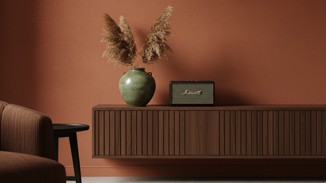
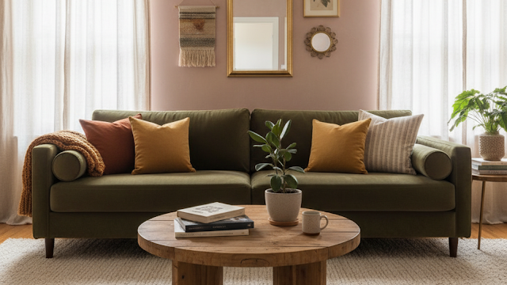

# The 2025 Interior Design Trends We’re Actually Excited About (And How to Get Them)

Let's be honest for a second. Most "trend" articles are... a little boring. They show up every year telling us that "gray is out" (we *knew* that three years ago) and "plants are in" (truly groundbreaking). They use phrases like "elevate your space" and "curated vignettes," and I just tune out.

But this year feels different.

As someone who lives and breathes this stuff for Mitti & Moss, I’ve been watching the 2025 interior design trends bubble up, and I’m genuinely excited. For the first time in a long time, the trends aren't about creating a sterile, "Instagram-perfect" house that no one actually lives in.

Instead, we’re *finally* seeing a massive shift toward spaces that feel... well, **human**. We’re talking about texture, warmth, and personality. We're talking about homes that reflect the people inside them, not just what a catalog told them to buy.

So, if you’re tired of the cold, minimalist void and ready for something that feels like a home, you’re in the right place. These are the 2025 trends that matter. Ready to see what I mean?

## The "Brown-aissance" Is Here (And It’s About Time)

Remember when we all collectively decided to paint every single wall in our homes a lovely, uninspired shade of "builder's beige" or "depressing gray"? Yeah, we’re all formally apologizing for that now.

In 2025, **color is back**, but not in a loud, obnoxious way. We’re leaning into rich, [warm, saturated, and *earthy* tones.](/blog/modern-living-room-decor-2025-40-expert-ideas)

I’m talking deep terracotta, dusty rose, mossy greens (had to say it!), and every single shade of brown you can imagine. Chocolate, espresso, caramel, walnut, camel... it’s all on the table. These colors feel grounding. They have weight. They make a room feel like a hug, not a hospital waiting room.

## How to Use Brown Without Going Full 70s Basement

I know what you're thinking. "Brown? Like my grandma's wood-paneled basement?"

No. We're not doing *that*. The key to making these deep, warm tones work in 2025 is all about **texture and light**.

A flat, cheap-looking brown wall? That's a "no." But a rich, dark **walnut-stained media console** [Modern Walnut Media Console](https://amzn.to/47Dp5sf) feels timeless and sophisticated. A deep brown velvet or corduroy sofa feels incredibly luxurious, not dated.

My personal obsession? Mixing brown with black. A black metal frame on a walnut bookshelf or black hardware on a deep brown cabinet is just *chef's kiss*.

**Here’s how to ease into it:**
- **Start Small:** If you’re color-phobic (it's okay, we've all been there), start with textiles. A **terracotta-colored throw blanket** or some deep olive green pillows will instantly warm up a beige sofa.
- **Go Big on Wood:** This is the easiest win. Look for furniture in acacia, mango, or walnut wood tones. The natural grain provides texture and warmth all at once.
- **Try a "Statement" Piece:** Find one thing you love in a rich, earthy tone. Maybe it's a deep brown leather armchair. Let it be the anchor for the room, and keep the other elements lighter.

Why did we ever think a sterile white box was "relaxing," anyway? IMO, 2025 is the year our homes finally give us a warm welcome.

## Biophilia 2.0: It's Not Just a Plant in the Corner

Okay, we’ve all been stuffing our homes with fiddle-leaf figs and monsteras for years. We get it. "Plants are good."

But 2025 takes "[biophilic design](/blog/green-bedroom-furniture-ideas)" (the idea that humans have an innate connection to nature) way more seriously. It’s no longer just about *having* plants. It’s about creating an entire *ecosystem* that mimics the patterns, lighting, and materials of the natural world.

It's less "I own a plant" and more "My home is a natural environment."

## So, What Does This Actually Look Like?

We’re thinking bigger. We're using **natural light** as a primary design feature, not an afterthought. We’re using materials that *feel* like the outdoors.

Think **raw stone**, **unfinished wood**, **bamboo**, and **terracotta pots**. It's about fabrics like **linen, hemp, and jute**.

I recently took a chance and swapped my heavy blackout curtains for some airy, **sheer linen ones** [Belgian Flax Linen Curtains](https://amzn.to/3LsaR6a). The difference in my living room's *vibe* is insane. The way the light filters through in the morning... I just can't be in a bad mood. It feels alive.

This trend is perfect for us at Mitti & Moss because it’s literally in our name. It's about connecting with the "Mitti" (earth).

**You can incorporate Biophilia 2.0 by:**
- **Maximizing Light:** Ditch those heavy drapes. Use mirrors to bounce light around. Make your windows a focal point.
- **Using Natural Materials:** A **jute rug** underfoot, rattan or cane furniture, woven pendant lights. These things add texture *and* a connection to nature.
- **Thinking About "Pattern":** Nature is rarely a flat, solid color. Look for subtle botanical prints, wood-grain motifs, or fabrics with natural, imperfect weaves.

This is about creating a space that calms your nervous system the second you walk in the door. And who doesn't need more of that?

## Texture Is the New Pattern

If you’re not touching your walls, you’re doing 2025 wrong.

I'm only half-kidding. We are so, *so* done with flat, boring surfaces. After years of staring at flat screens, our senses are starved. We crave things that engage our sense of touch.

This trend is where the "Mitti" (earth) part of our philosophy really shines. Think **[limewash or plaster-effect walls](/blog/limewash-living-rooms-warm-textured)** that have a soft, chalky, movable quality. Think ridiculously soft bouclé chairs, chunky knit blankets, and hand-scraped wood floors.

It's about creating a "high-touch" environment that your hands love just as much as your eyes. (Just... maybe don't go around petting *all* the walls in public. :/)

## How to "Layer" Your Textures

The best-designed rooms have a mix of hard and soft, rough and smooth. This is what gives a space depth and makes it feel "finished."

If your sofa is a soft, smooth velvet, pair it with a **rough-hewn wooden coffee table**. If your floors are sleek tile, warm them up with a **high-pile wool rug**.

**Here are some of my favorite textural combos for 2025:**
- **On the Walls:** Limewash, Roman clay, textured or grasscloth wallpaper. Even "paint" with a suede or mineral finish is having a moment.
- **On Furniture:** Bouclé, shearling, corduroy, raw silk, and heavy linen are everywhere. We’re also seeing a ton of **fluted wood panels** on cabinets and headboards.
- **On the Floor:** Layering is key. Put a smaller, softer rug (like a faux sheepskin) on top of a larger, flat-weave jute rug. The contrast is fantastic.
- **Small Details:** Think **hammered metal bowls**, **ceramic vases with a rough glaze**, or even just a stack of textured art books.

This tactile trend is all about slowing down and engaging with your physical surroundings. It’s cozy, sophisticated, and deeply human.

## Sustainable & Artisanal (AKA "Conscious Decor")

This one is my personal favorite, and it’s one of the biggest trending interior design topics for 2025.

The era of fast-fashion-for-furniture is finally, *finally* slowing down. We all bought that cheap-o bookshelf that looked great online, only to have it sag in the middle six months later. We’re tired of it.

We’re tired of the waste. We’re tired of the bland uniformity. And we’re starting to ask *where* our stuff comes from.

2025 is all about **"conscious decor."** This means we’re prioritizing **sustainability, durability, and craftsmanship**. We’re choosing fewer, better things. We want pieces that are built to last, not to be thrown out when the next micro-trend hits.

## How to Shop Smarter, Not Harder

Isn't it better to have one amazing, hand-crafted chair you'll love for a decade than five cheap, wobbly ones that all end up in a landfill?

That’s the core idea here.
- **Vintage is King:** Flea markets, antique malls, and online vintage shops are your best friends. You get a unique piece with a story, it’s almost always better-made than new stuff, *and* you keep it out of the trash. Win-win-win.
- **Look for Materials:** Focus on **reclaimed wood**, **recycled metals or glass**, and **natural, renewable fibers** like bamboo, cork, and wool.
- **Support Small:** This is the "artisanal" part. Find a local potter for your mugs. Buy a print from an independent artist. Look for small-batch furniture makers. These pieces add a soul to your home that mass-produced items just can't.
- **Check Your Labels:** Even big retailers are getting better. Look for collections that specify sustainable sourcing (like FSC-certified wood) or use recycled materials. We love seeing things like **bamboo-based drawer organizers** [Expandable Bamboo Organizers](https://amzn.to/3LkIXZY) or beautiful rugs woven from recycled plastic bottles.

This trend isn't just about "being green"—it's about creating a home that is truly, uniquely *yours*.

## "Quiet Luxury" & Curated Spaces

You’ve probably heard the "quiet luxury" buzzword in fashion. Well, now it's in our homes.

But don't let the "luxury" part scare you off. This isn't about gold-plated *everything* or covering your stuff in designer logos. In fact, it's the exact opposite.

"Quiet luxury" in home design is about **investing in high-quality, timeless materials** over flashy, "it" items. It’s subtle, it’s refined, and it *feels* expensive without ever shouting about it.

It’s choosing **solid wood** over particle board.
It’s picking **marble or soapstone** over laminate.
It’s saving up for a **wool or silk rug** instead of an acrylic one.

My big "quiet luxury" move last year was saving up for a *really* good, hand-knotted **wool area rug** [Hand-Knotted Wool Rug](https://amzn.to/3JFNlCh). It cost more upfront than any rug I’d ever bought, but the difference is staggering. It’s durable, it’s incredibly soft, and I know I will have it for the rest of my life. Zero regrets.

## It’s Also About What You Don’t Show

This trend pairs perfectly with what I call **"curated maximalism."**

It’s not about minimalism (having no stuff) or "cluttercore" (having *all* the stuff). It’s about being an **editor**. It means finally getting that high-quality bookshelf to thoughtfully display your favorite objects and books, rather than letting them pile up on a table.

It’s intentional. It’s personal. It's about surrounding yourself *only* with things that you find beautiful, useful, or meaningful. This, more than any specific color, is the *real* trend for 2025.

## So, What’s the Big Takeaway?

If I had to sum up all the 2025 interior design trends, it’s this: **We are finally creating homes that feel as good as they look.**

We’re ditching the cold, sterile, look-but-don't-touch vibes.
We’re trading flat-pack uniformity for earthy, natural, and personal spaces.
We’re embracing warmth, texture, and items that have a story.

And frankly, it’s about time
