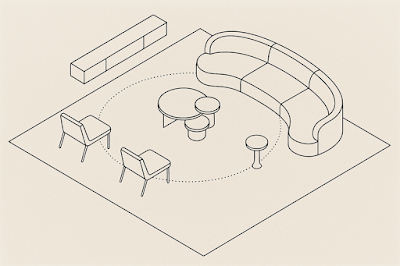
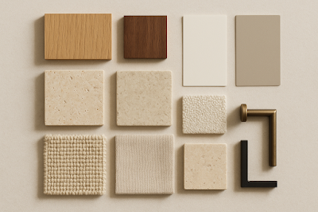

# 40 Modern Living Room Ideas for 2025 (That Don't All Look the Same)

Here's my problem with most "modern living room ideas" lists—they show you 40 photos of rooms that cost $200K and tell you to "recreate the vibe." Cool. Let me just casually source that custom Italian modular sofa.

In reality, making a living room feel modern in 2025 comes down to a handful of moves that work at any budget. The pros repeat the same tricks over and over—it's the *combination* that makes each room feel different. And honestly? Most of these are things you can swap in this weekend.

## What "Modern" Actually Means in 2025

It's not what it was five years ago. The ultra-minimal, all-white, no-personality rooms are out. What's replaced them is warmer, more textured, more... human.

Designers in 2025 are doing what I'd call **quiet luxury**—[editing hard](/blog/japandi-living-room-ideas), investing in fewer but better pieces, and letting materials speak for themselves. Natural woods, real stone, soft metals. Rooms that calm you down instead of impressing you. Big difference.

The best part? You don't need a gut renovation. Small, intentional swaps—a lamp here, a rug there, paint one wall—genuinely transform a space.

## The Colour Palette That's Running Everything

If I could summarise the 2025 colour story in one word: **warm**.

Warm whites, oat, greige, mushroom—these are the base colours that make a living room glow at night and feel crisp during the day. I add depth with taupe microcement walls, [limewash finishes](/blog/limewash-living-rooms-warm-textured), and aged brass touches. Heavy contrast gets reserved for accents—a bronze lamp, a charcoal cushion, an olive throw.

**Palette starter kit:**
- **Walls:** Warm white or mushroom (not stark white—there's a difference)
- **Wood tones:** Light oak, walnut, or ash mixed together (yes, mixing wood tones is fine)
- **Stone accents:** Travertine, tumbled limestone, or soapstone
- **Metals:** Aged brass and blackened bronze—skip chrome, skip polished nickel

One colour adjustment—going from cool white to warm white walls—can shift the entire energy of a room. It's honestly ridiculous how much difference it makes for the cost of a tin of paint.

## The 40 Ideas, Grouped So You Can Actually Use Them

### Colour & Walls (Ideas 1-10)

1. **Warm white walls** as your canvas (Benjamin Moore "White Dove" or equivalent)
2. **Taupe microcement accent wall** behind the sofa—instant texture upgrade
3. **Limewash feature wall** for that chalky, old-world depth
4. **Charcoal or bronze-painted trim** instead of standard white trim
5. **Earthy green accent wall**—sage or olive, not kelly green
6. **Terracotta and rust-toned pillows** scattered sparingly
7. **Layered greige palette** where walls, sofa, and rug are all slightly different shades of the same colour
8. **Tone-on-tone monochrome**—everything beige but with texture doing the heavy lifting
9. **Mixed light and dark woods** in the same room (oak shelf + walnut console = chef's kiss)
10. **Stone-led colour story**—let a travertine coffee table set the palette and build outward

### Furniture & Layout (Ideas 11-20)

11. **Low-slung modular sofa**—[this performance fabric one](https://amzn.to/4oqTBgj) works surprisingly well
12. **Curved sofa** to soften a room full of straight lines and right angles
13. **Slim-armed lounge chairs** that don't eat floor space
14. **Nesting coffee tables** instead of one massive piece—way more flexible
15. **Floating media console** mounted to the wall for clean floor lines
16. **Built-in banquette nook** by the window if you have the space
17. **[Storage ottomans](https://amzn.to/3LhUida)** that hide blankets, remotes, and the general chaos of life
18. **Conversation-friendly U-shape layout**—face seating toward each other, not just the TV
19. **Oversized round rug** to define the seating zone—[wool or jute blends](https://amzn.to/43IOLm8) work best
20. **Petite pedestal side tables**—[travertine](https://amzn.to/4okpRSn) or [faux-stone options](https://amzn.to/3LgNOez) look great

### Lighting & Tech (Ideas 21-27)

This is the section most people skip, which is exactly why most living rooms feel off. Lighting is probably 30% of the vibe.

21. **Oversized paper pendant** as a statement fixture (Japanese rice paper vibes)
22. **Layered floor and table lamps** in warm-white—[aged brass works beautifully](https://amzn.to/43zI85G)
23. **Wall grazers** to show off textured walls—[limewash](/blog/limewash-living-rooms-warm-textured) deserves to be lit properly
24. **Smart dimmers on everything**—seriously, *everything*. This is the single most impactful upgrade
25. **[Picture light](https://amzn.to/4quYRAV)** over one hero art piece. Gallery lighting at home. Why not?
26. **Candle-style wall sconces** for ambient glow in evenings
27. **Backlit shelves** with LED strips for a soft glow behind books and objects

### Texture & Materials (Ideas 28-33)

28. **Bouclé upholstery on one piece**—balanced with linen or cotton on another. Don't do all bouclé (it gets overwhelming)
29. **Jute-wool blend rug** for durability and warmth
30. **Travertine or stone drinks table** as a texture anchor
31. **Fluted wood wall panel** behind the TV or as a room divider
32. **Aged brass accents**—frames, candle holders, shelf brackets
33. **[Blackened bronze curtain rods](https://amzn.to/47fDR9U)** that actually support heavy [linen curtains](https://amzn.to/47gLjBB)

### Styling & Art (Ideas 34-40)

34. **One oversized art piece** instead of a scattered gallery wall. Go big or go home
35. **Sculptural dry branches** in a tall ceramic vase—literally free if you find the right branch
36. **Hand-thrown ceramic vessels** grouped in odd numbers (ones and threes, not twos and fours)
37. **Stacked coffee-table books** as both decor and conversation starters
38. **Minimal mantle styling**—three objects max, varied heights
39. **[Layered sheers + linen drapes](https://amzn.to/47gLjBB)** for depth at the window
40. **Plant clusters in threes**—one tall, one medium, one trailing

## The 5-Minute Styling Formula

Don't overthink it. Here's what actually works:

Start with the rug—it defines the zone. Position a curved or modular sofa facing the main conversation area (not facing the TV—I know, radical). Add two accent chairs angled in, a mixed-material coffee table, and three light sources on dimmers.

Style with one large art moment, branches or flowers in a ceramic vase, and five objects max on the coffee table. That's it. Five objects. Not fifteen.

## Bottom Line

The best modern living rooms in 2025 aren't the fanciest—they're the ones that feel *right*. Warm colours, honest materials, lighting that flatters everyone, and enough restraint to let each piece breathe.

Pick three ideas from this list. Just three. Swap one lamp, try one new colour, rearrange one corner. That's genuinely how it starts. The room will tell you what it needs next.

*As an Amazon Associate, I earn from qualifying purchases.*
